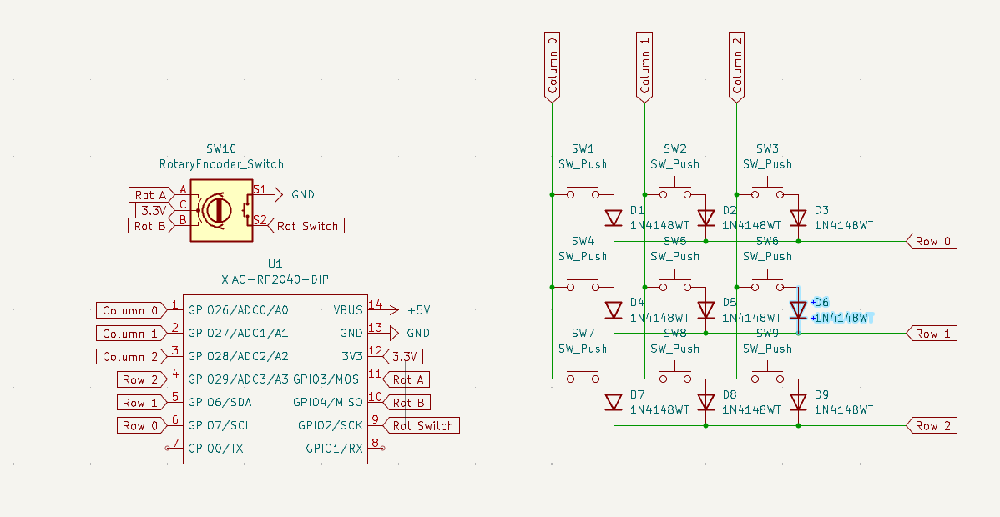
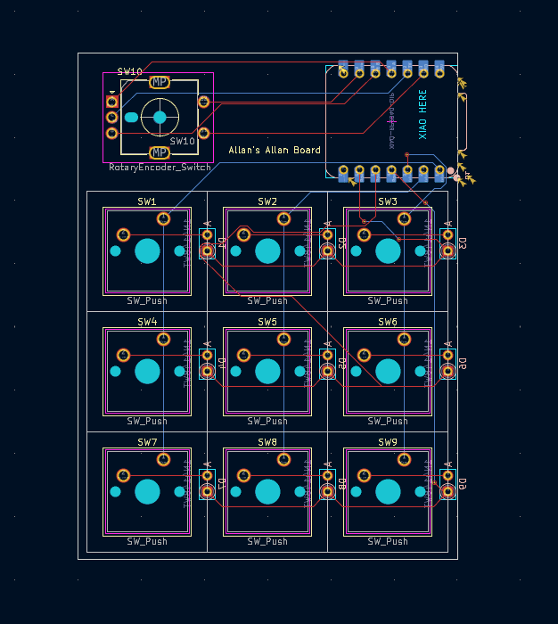

#May 31: Making the Schematics 

Hi! this is my first ever hardware project, and although I don't believe Journaling is mandatory I thought it best to document everything. 
Finally installed OPL Kicad Library after 30 minutes, hopefully the entire process isnt this slow.
For my schematic [How to design Mechanical Keyboards PCBs with Kicad](https://www.youtube.com/watch?v=8WXpGTIbxlQ&t=320s&ab_channel=JoeScotto) was very helpful 

I knew how I wanted my macropad to look like, and after copying the HackClub tutorial exactly I decided to try again but this time creating a matrix

Honestly can say the hardest part of this was trying to find the correct footprint for the parts but I'm happy with what I learnt 
**Total time spent: 2H30min**

#May 31: Completing the PCB

At this point, I had to stop relying on tutorials and start problem solving on my own. Many things came up, especially when routing the traces.
I accidently moved the MCU then saved and closed Kicad, so wouldn't recommend as I had to reroute lots of things. 
