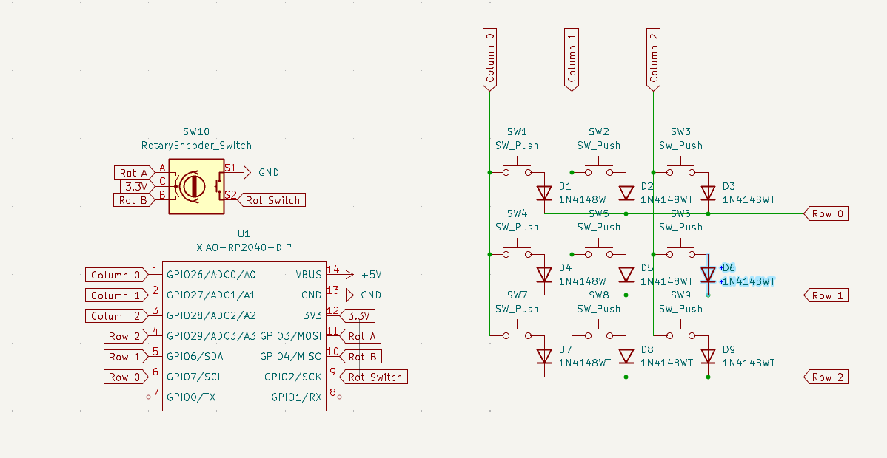
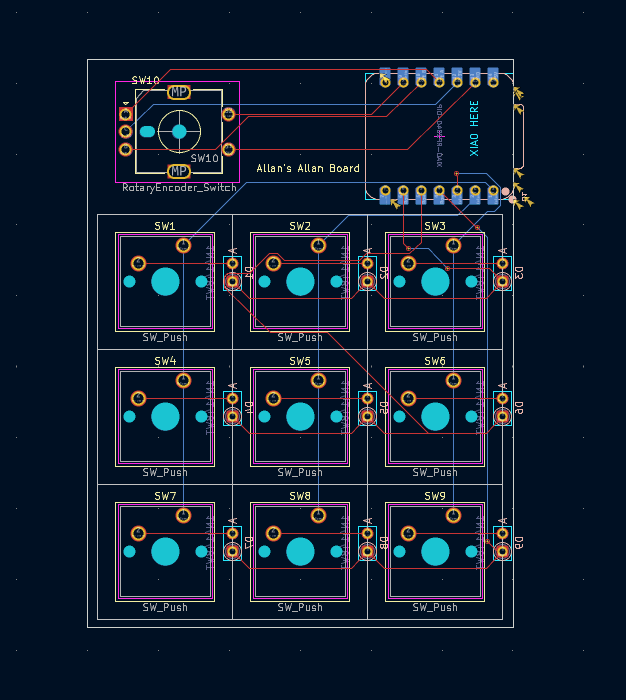
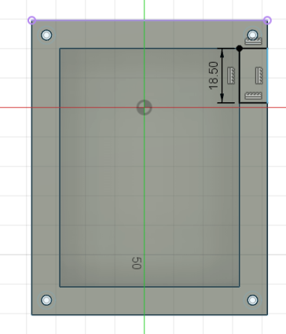
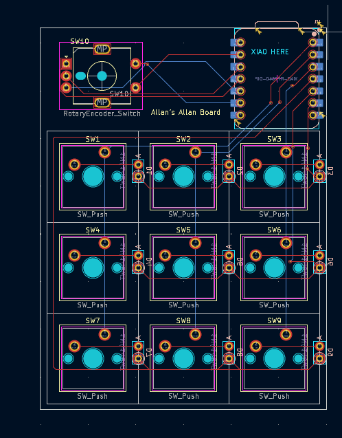
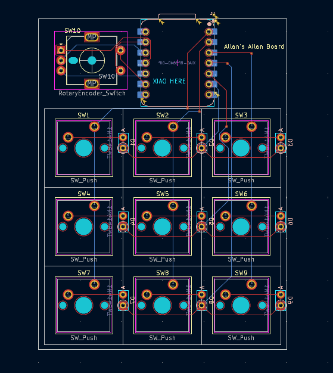

#May 31: Making the Schematics 

Hi! this is my first ever hardware project, and although I don't believe Journaling is mandatory I thought it best to document everything. 
Finally installed OPL Kicad Library after 30 minutes, hopefully the entire process isnt this slow.
For my schematic [How to design Mechanical Keyboards PCBs with Kicad](https://www.youtube.com/watch?v=8WXpGTIbxlQ&t=320s&ab_channel=JoeScotto) was very helpful 

I knew how I wanted my macropad to look like, and after copying the HackClub tutorial exactly I decided to try again but this time creating a matrix

Honestly can say the hardest part of this was trying to find the correct footprint for the parts but I'm happy with what I learnt 
**Total time spent: 2H30min**

#May 31: Completing the PCB

At this point, I had to stop relying on tutorials and start problem solving on my own. Many things came up, especially when routing the traces.
I accidently moved the MCU then saved and closed Kicad, so wouldn't recommend as I had to reroute lots of things. 

**Total time spent 2H**

#May 32: Beginning the case

So I started off thinking that the case would be one of the easier steps of my process, but how wrong I was. 

Turns out my schematics woulddn't fit properly with the case, based off where I put the MCU and how it lined up with the holes.
I could either redesign the case, or fix the PCB which I figured would be better as to not create further problems later on. 

**Total time spent 2H**

#May 32: Refinishing the PCB

Initially It was going well, I rerouted the traces connected to the MCU, like 10 of them. 

Yeah so turns out I made the same mistake **again** 
I only rotated the MCU, instead of centering it to avoid interference with the case. Time to redo again.
also note: I actually made the biggest mistake ever I closed the window for some reason so I couldn't just revert my changes. 

Finally finished, I made sure to double check that nothing was going to interfere.
On the brightside, I learned a lot about routing traces, and I made sure to be more careful as I know If there was mistake I have to correct it. 

**Total time spent 45min**

#May 32: Finishing the CAD

Mostly just working on it, not much to say

**Total time spent 2h**