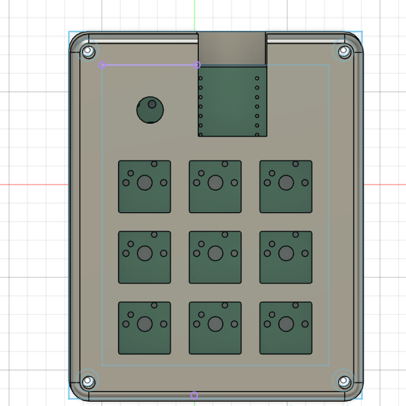

#May 31: Making the Schematics 

Hi! this is my first ever hardware project, and although I don't believe Journaling is mandatory I thought it best to document everything. 
Finally installed OPL Kicad Library after 30 minutes, hopefully the entire process isnt this slow.
For my schematic [How to design Mechanical Keyboards PCBs with Kicad](https://www.youtube.com/watch?v=8WXpGTIbxlQ&t=320s&ab_channel=JoeScotto) was very helpful 

I knew how I wanted my macropad to look like, and after copying the HackClub tutorial exactly I decided to try again but this time creating a matrix

Honestly can say the hardest part of this was trying to find the correct footprint for the parts but I'm happy with what I learnt 
**Total time spent: 2H30min**

#May 31: Completing the PCB

At this point, I had to stop relying on tutorials and start problem solving on my own. Many things came up, especially when routing the traces.
I accidently moved the MCU then saved and closed Kicad, so wouldn't recommend as I had to reroute lots of things. 

**Total time spent 2H**

#May 32: Beginning the case

So I started off thinking that the case would be one of the easier steps of my process, but how wrong I was. 

Turns out my schematics woulddn't fit properly with the case, based off where I put the MCU and how it lined up with the holes.
I could either redesign the case, or fix the PCB which I figured would be better as to not create further problems later on. 

**Total time spent 2H**

#May 32: Refinishing the PCB

Initially It was going well, I rerouted the traces connected to the MCU, like 10 of them. 

Yeah so turns out I made the same mistake **again** 
I only rotated the MCU, instead of centering it to avoid interference with the case. Time to redo again.
also note: I actually made the biggest mistake ever I closed the window for some reason so I couldn't just revert my changes. 

Finally finished, I made sure to double check that nothing was going to interfere.
On the brightside, I learned a lot about routing traces, and I made sure to be more careful as I know If there was mistake I have to correct it. 

**Total time spent 45min**

#May 32: Finishing the CAD

Mostly just working on it, not much to say

**Total time spent 2h**

#June 4: fixing my pcb 

Kind of odd, I got my project approved (please don't unapprove) then I go on hackpad website, **I used the wrong diode footprint**
Actually easier fix than I thought, I thankfully only had to reroute a few easy traces, and it doesn't impact any functions. 

pictureeee

My gerber file for the pcb manufactuer finally got accepted after like 3 times so that's also cool
also just realised half of my journal entries are may 32 so lots of fun

**Total time spent 20min**

#July 4: doing the build

ok ik it is already into August, but when i started this project 2 months ago im like 99% sure you didn't need a journal for hackpad?? I made one anyways but here we are now and I kinda need to ship project for my travel stipend. The build was pretty easy and I can recall everything that happened but pls don't reject because I have no progress images.

So I started off by practicing soldering with one of the pcbs and a few extra switches/diodes
It was actually going pretty well so i started doing the hackpad.

It was around this point I realised I had made a circular cutout for the rotary encoder when I actually needed a square??? I thought about redoing the print but I kinda just took the solder and melted the case until the rot encoder fit. One thing I was really stupid about tho was when soldering the diodes and cutting the ends off for some reason I didn't grab the ends with a plier. Idk if that makes complete sense but basically I cut the excess of the diode off and the pieces just started flying. It's been two months and i'm still missing two pieces of wire but hopefully it isn't too bad. Other than that I didn't have any real problems with my hackpad, it was a pretty self explanatory assembly and my favourite part about it was snapping the swithces into the plate. I loaded firmware and everything was fine. Honestly don't exactly know what to talk about for the assembly cuz it just took a bit of time but wasn't actually that hard so hopefully this is detailed enough.

**Total time spent 4h**
also heres a picture of the finish product
