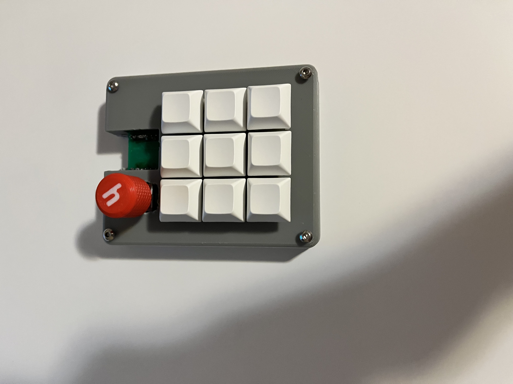
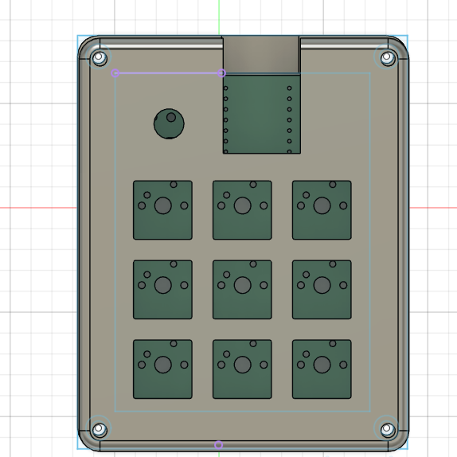

# allanpad

Allanpad is a 9 key macropad with a rotary encoder, and uses KMK firmware.

## Features:
-3d printed case
-EC 11 Rotary encoder
-9 Keys

## CAD Model:
Everything goes together with 4 M3 screws for the case

It has the bottom part where the pcb goes and the top cover for it.

Made in Fusion360

## PCB
The PCB was created in KICAD

Schematic

PCB

## Firmware Overview
The hackpad uses kmk firmware for everything

- the rotary encoder changes volume. press to mute
- The 9 keys are macros that I can change

## BOM:
Everything needed to make the macropad

- 9x Cherry MX Switches
- 9x DSA Keycaps
- 4x M3x5x4 Heatset inserts
- 4x x16mm SHCS Bolts
- 9 1N4148 DO-35 Diodes.
- 1x EC11 Rotary Encoder
- 1x XIAO RP2040
- 1x Case (2 printed parts)

